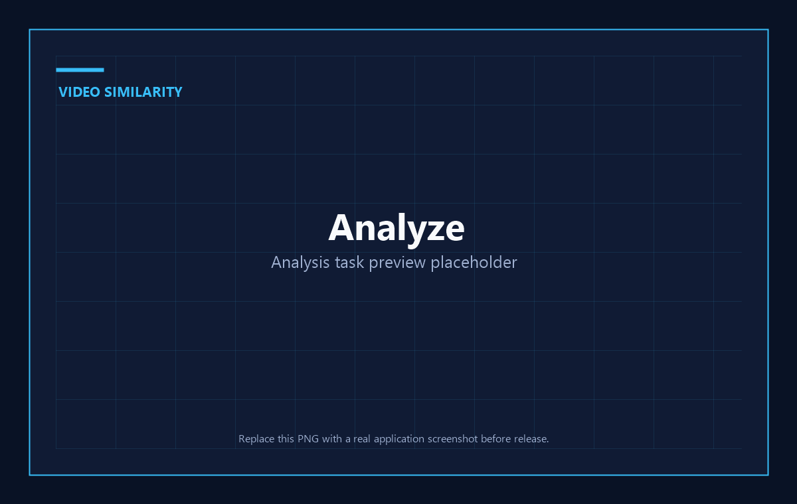
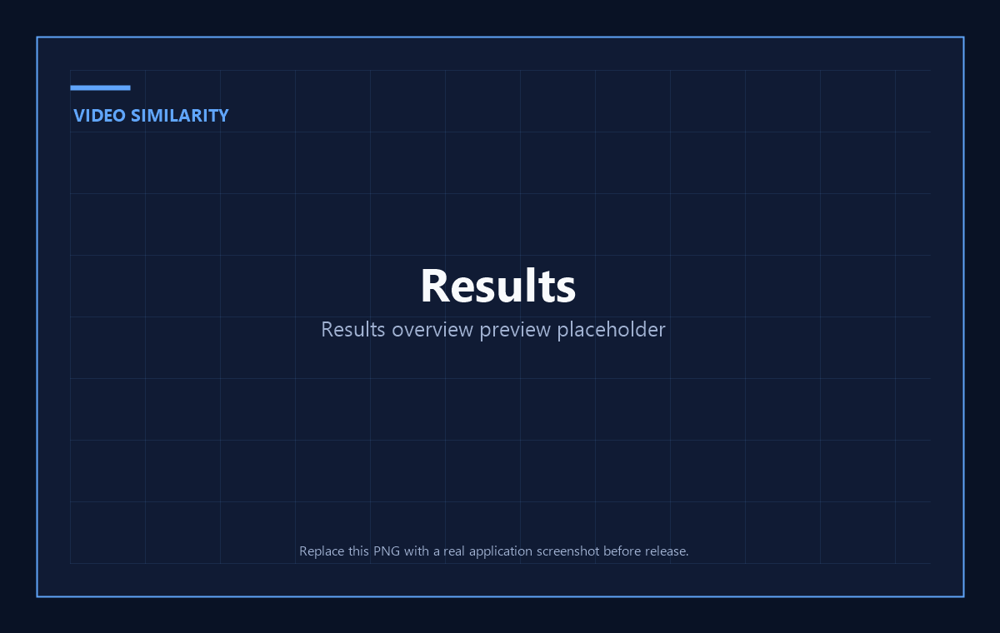
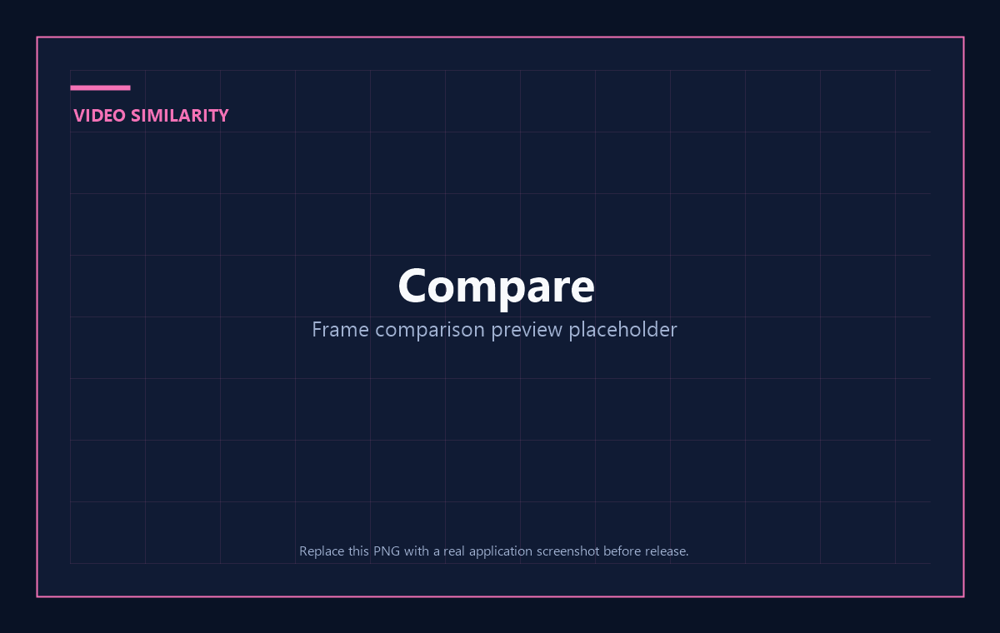
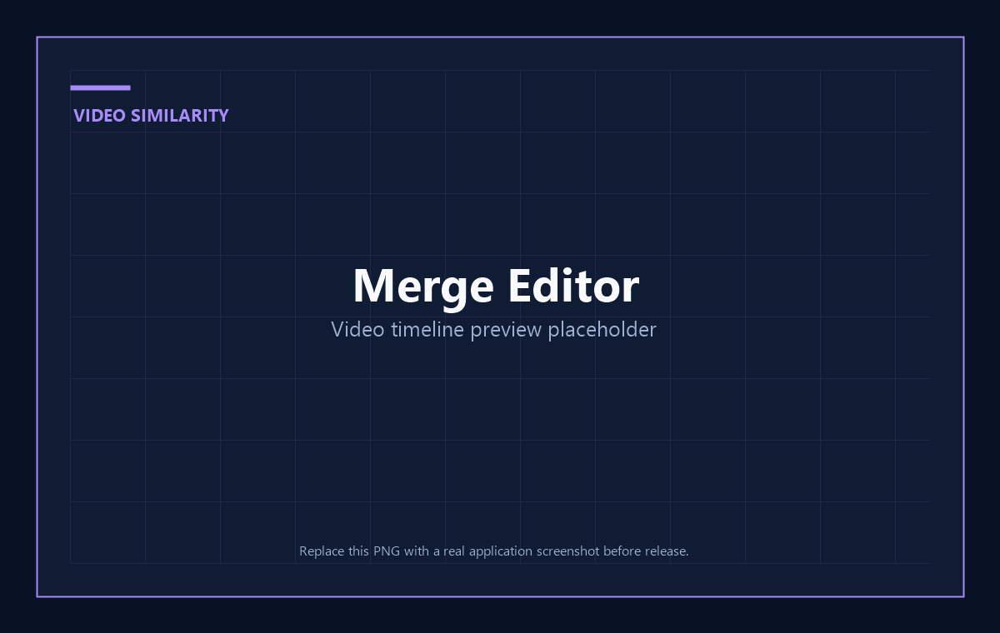
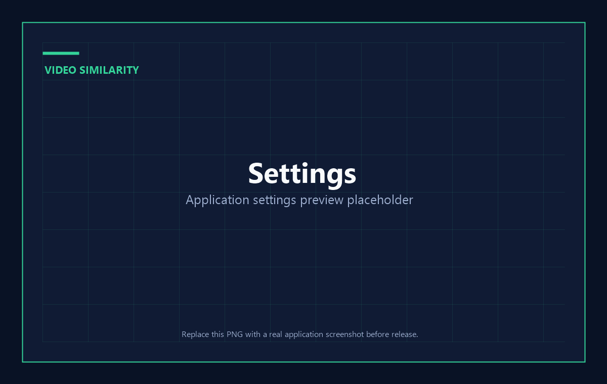

# Video Similarity & Containment Detector

[](https://github.com/RoamerFly/video-similarity-detector/releases)

本地优先的视频相似度、片段包含关系和重复文件分析工具。

[](LICENSE)


Video Similarity & Containment Detector 会扫描指定目录中的视频，通过动态抽帧、画面预处理、CLIP 特征、FAISS 检索和时间一致性分析，计算视频之间的双向覆盖率、整体相似度、匹配片段和时间窗口结果。

所有视频、缓存和报告默认保存在本机，不依赖远程服务。

## 下载

前往 [GitHub Releases](https://github.com/RoamerFly/video-similarity-detector/releases) 下载 Windows、Linux 或 macOS 版本。发布文件采用以下命名规则：

```text
Video_Similarity-v<版本>-linux-x64-installer.deb
Video_Similarity-v<版本>-linux-x64-installer.rpm
Video_Similarity-v<版本>-linux-x64-portable.tar.gz
Video_Similarity-v<版本>-macos-arm64-installer.dmg
Video_Similarity-v<版本>-macos-arm64-portable.zip
Video_Similarity-v<版本>-macos-x64-installer.dmg
Video_Similarity-v<版本>-macos-x64-portable.zip
Video_Similarity-v<版本>-windows-x64-cpu-installer.exe
Video_Similarity-v<版本>-windows-x64-cpu-portable.zip
Video_Similarity-v<版本>-windows-x64-gpu-installer.exe
Video_Similarity-v<版本>-windows-x64-gpu-portable.zip
```

安装包和便携包都内置 Python 运行环境、FFmpeg 与 FFprobe，下载后无需另行安装这些依赖。Windows GPU 版内置 CUDA 版 PyTorch，适合具有兼容 NVIDIA 显卡和驱动的设备；其他用户请选择 CPU 版。

Windows GPU 安装包使用项目自带的 ZIP64 自解压安装器，默认安装到当前用户的本地程序目录，从而避开传统 NSIS 对超大 CUDA 运行时的文件大小限制。

## 功能

- 动态抽帧：根据画面变化决定保留哪些帧，避免固定抽帧遗漏内容。
- 双向包含分析：分别计算 `A in B` 和 `B in A`，识别片段包含、部分重叠和近似重复。
- 统一预处理：支持裁剪黑边、竖屏旋转、统一分辨率和画面适配。
- 大批量优化：每个视频独立缓存帧特征，并在精确比较前执行候选粗筛。
- 断点恢复：取消或中断后可复用已完成的视频缓存和视频对结果。
- 结果管理：排序、筛选、分页、多选删除记录或源视频文件。
- 人工复核：并排播放视频，查看 A 到 B、B 到 A 的相似帧和算法视角。
- 多轨时间线编辑：拆分、旋转、裁剪和跨轨拖放片段，支持多视频组合布局、音频混响与撤销重做。
- 结构化报告：生成 JSON、CSV 和 HTML 报告。
- CPU/GPU 构建：Windows 同时发布 CPU 与 CUDA GPU 的安装包和便携包。
- 单实例和系统托盘：避免重复启动，可配置关闭时退出或最小化到托盘。

## 界面预览

以下图片来自当前桌面应用的真实界面。

| 分析任务 | 结果总览 |
| --- | --- |
|  |  |

| 对比视图 | 合并视频 |
| --- | --- |
|  |  |

| 设置 |
| --- |
|  |

## 工作原理

```text
扫描视频
  -> 裁剪黑边、旋转和缩放
  -> 动态抽帧
  -> 缓存每个视频的帧特征
  -> 全局候选粗筛
  -> A 到 B / B 到 A 双向帧匹配
  -> 时间一致性覆盖率
  -> 匹配片段和时间窗口
  -> JSON / CSV / HTML 报告
```

批量比较不会为每个视频对重复抽帧。同一视频在文件和分析参数未变化时，会直接复用已有缓存。

更详细的算法和参数说明：

- [识别逻辑说明](README_RECO.md)
- [设置与参数说明](README_SET.md)

## 支持格式

视频：

```text
mp4, mkv, avi, mov, webm, flv, wmv
```

音频线：

```text
mp3, wav, flac, aac, m4a, ogg, opus, wma
```

浏览器内置播放器是否能直接播放视频，还会受到 Windows WebView2 和视频编码格式影响。无法播放时，对比视图会尝试显示帧预览。

## 快速开始

### 使用 Windows 便携版

CPU 版：

```text
desktop/dist_windows/
├─ video-similarity-desktop.exe
├─ env/                         # Python、FFmpeg、FFprobe
└─ data/
```

GPU 版：

```text
desktop/dist_windows_gpu/
├─ video-similarity-desktop.exe
├─ env/                         # CUDA PyTorch、FFmpeg、FFprobe
└─ data/
```

直接运行 `video-similarity-desktop.exe`。GPU 版需要兼容的 NVIDIA 显卡和驱动，程序会在设置页显示 CUDA 检测结果。

不要单独移动 EXE。`env/` 是完整内置运行环境，包含 Python、FFmpeg 与 FFprobe；`data/` 用于缓存、断点和报告。

### 从源码运行

环境要求：

- Node.js 20+
- Rust stable
- Python 3.10+
- Windows WebView2 Runtime
- 可选：NVIDIA GPU 与兼容的 CUDA 驱动

```powershell
git clone <repository-url>
cd video-containment-detector

python -m pip install -r requirements.txt

cd desktop
npm install
npm run tauri:dev
```

首次运行模型分析时，可能需要下载模型文件。打包环境默认不包含 Python 开发测试依赖。

## 使用方法

1. 在“设置 > 基础设置”中确认项目、视频、缓存和报告目录。
2. 在“设置 > 分析配置”中选择预设或调整参数。
3. 进入“分析任务”，双击视频目录或点击选择按钮。
4. 扫描视频并启动分析。
5. 在日志栏切换“正常输出”和“错误输出”，查看实时状态。
6. 分析完成后，在“结果总览”中筛选、排序或选择报告。
7. 双击结果行进入“对比视图”，人工检查视频和相似帧。
8. 右键视频可加入“合并视频”时间线，或在确认后删除源文件。

### 结果多选

“结果总览”默认隐藏复选框。点击“多选”后，每行会显示：

- 最左侧复选框：选择结果记录。
- 视频 A 复选框：选择视频 A 源文件。
- 视频 B 复选框：选择视频 B 源文件。

“仅删除记录”不会删除磁盘文件。“删除视频文件”会永久删除源文件并要求确认。

### 时间线编辑

“合并视频”页面支持：

- 播放预览和全局播放头定位。
- 在播放头位置拆分视频片段。
- 新建和删除多条视频线、音频线，长按片段可跨轨移动。
- 多个视频重叠时可使用自动、宫格、左右、上下布局，也可在播放窗口自由拖放和整体缩放。
- 调整片段入点、出点、旋转和单片段裁剪。
- 提取视频原音到音频线。
- 导入或拖入外部音频，并调整音频时间线位置；重叠音频会自动混响。
- 自定义输出分辨率与留黑/留白方式，并设置画面适配、帧率、CRF 和分割方式。
- 导出过程中仍可播放和检查时间线，编辑不会改变已经提交的导出任务。

最终导出由 FFmpeg 完成。

## 数据与缓存

打包版优先使用 EXE 同级的 `data/`：

```text
data/
├─ video_cache/             # 每个视频的抽帧与 CLIP 特征
├─ cache/ui/                # 报告列表和页面读取缓存
├─ frames/ui_comparison/    # 算法视角帧预览缓存
├─ reports/                 # JSON、CSV、HTML 报告
└─ .runtime/                # 任务运行状态
```

缓存有效性会检查视频路径、大小、修改时间、抽帧参数、预处理参数和模型版本。设置页提供按视频查看和清理缓存的功能。

## 命令行

桌面端底层使用同一套 Python 分析脚本：

```powershell
python scripts/batch_compare.py `
  --input videos `
  --cache-dir data `
  --output data/reports/report.json `
  --skip-threshold 0.60 `
  --match-threshold 0.65 `
  --window-size 30 `
  --top-k 10 `
  --candidate-limit 20 `
  --max-gap-sec 5 `
  --frame-step 1 `
  --crop-black-borders
```

查看完整参数：

```powershell
python scripts/batch_compare.py --help
```

## 开发

### 前端

```powershell
cd desktop
npm install
npm run dev
npm run lint
npm run build
```

### Tauri

```powershell
cd desktop
npm run tauri:dev

cd src-tauri
cargo check
```

### Python 测试

```powershell
python -m pip install -r requirements.txt
python -m pytest
```

### 视觉验收

```powershell
cd desktop
npm run dev
npm run visual:qa
```

真实 Tauri 模式：

```powershell
npm run tauri:dev
npm run visual:qa:real
```

视觉验收产物保存在 `desktop/visual-qa-output/`。TypeScript、Vite 或 Rust 编译通过不等同于截图级视觉 QA 通过。

## 构建

### Windows CPU

```powershell
cd desktop
.\build-windows.bat
```

输出目录：`desktop/dist_windows/`

### Windows GPU

```powershell
cd desktop
.\build-windows-gpu.bat
```

输出目录：`desktop/dist_windows_gpu/`

### Linux

```bash
cd desktop
./build-linux.sh
```

输出目录：`desktop/dist_linux/`

### macOS

```bash
cd desktop
./build-macos.sh
```

输出目录：`desktop/dist_macos/`

构建脚本默认生成便携目录，并在缺少时自动下载对应平台的独立 FFmpeg/FFprobe。Python 环境、Torch 和系统依赖需要与目标操作系统及架构匹配，不能直接跨系统复制。

## 技术栈

| 层级 | 技术 |
| --- | --- |
| 桌面端 | Tauri 2、Rust |
| 前端 | React 19、TypeScript、Vite、Tailwind CSS |
| 状态与组件 | Zustand、Radix UI、Lucide |
| 视频处理 | OpenCV、Decord、FFmpeg |
| 特征模型 | PyTorch、Transformers、CLIP |
| 相似检索 | FAISS |
| 测试与视觉 QA | Pytest、Playwright |

## 项目结构

```text
video-containment-detector/
├─ desktop/                 # Tauri + React 桌面应用及构建脚本
├─ docs/screenshots/        # README PNG 界面预览
├─ scripts/                 # 分析、索引和视频合并入口
├─ tests/                   # Python 测试
├─ video_sim/               # 抽帧、预处理、嵌入、匹配与报告
├─ README_RECO.md           # 识别逻辑
├─ README_SET.md            # 设置参数
├─ requirements.txt
└─ LICENSE
```

## 路线图

- 增强不同编码格式的视频预览兼容性。
- 为时间线编辑器增加转场、音量包络和更多音轨。
- 增加候选粗筛和关系判定的基准数据集。
- 完善 Linux 和 macOS 打包验证。

## 贡献

Issue 和 Pull Request 均欢迎。

提交前建议：

1. 保持变更范围聚焦，并说明用户可见行为。
2. 算法变更应说明准确率、性能和缓存兼容性影响。
3. UI 变更应检查常见桌面尺寸和 `1586x992` 主验收尺寸。
4. 不要提交视频、模型、运行环境、缓存和报告等大文件。
5. 至少运行：

```powershell
cd desktop
npm run lint
npm run build
cd src-tauri
cargo check
```

## 安全与隐私

- 项目默认在本机处理视频，不主动上传媒体内容。
- 删除视频文件属于不可恢复操作，应用会在执行前请求确认。
- 不要分析或传播无权处理的媒体文件。
- 安全问题请通过私密渠道联系维护者，不要在公开 Issue 中披露敏感细节。

## 致谢

感谢以下开源项目和社区：

- [Tauri](https://tauri.app/)
- [React](https://react.dev/) 与 [Vite](https://vite.dev/)
- [Rust](https://www.rust-lang.org/) 与 [Python](https://www.python.org/)
- [PyTorch](https://pytorch.org/)
- [Hugging Face Transformers](https://huggingface.co/docs/transformers/)
- [OpenAI CLIP](https://github.com/openai/CLIP)
- [FAISS](https://github.com/facebookresearch/faiss)
- [OpenCV](https://opencv.org/)
- [Decord](https://github.com/dmlc/decord)
- [FFmpeg](https://ffmpeg.org/) 与 [imageio-ffmpeg](https://github.com/imageio/imageio-ffmpeg)
- [Radix UI](https://www.radix-ui.com/)、[Lucide](https://lucide.dev/) 与 [Zustand](https://zustand-demo.pmnd.rs/)
- [Playwright](https://playwright.dev/)

各依赖仍遵循其各自许可证。本项目的 MIT 许可证不替代第三方项目、模型或媒体内容的许可证要求。

## 许可证

本项目基于 [MIT License](LICENSE) 开源。

## 免责声明

本项目用于本地视频相似度分析、重复内容识别和媒体整理。分析结果可能存在误判，不应作为版权、法律或平台执法的唯一依据。使用者应确保拥有处理相关媒体的合法权利，并遵守适用法律、平台规则及第三方许可证。
