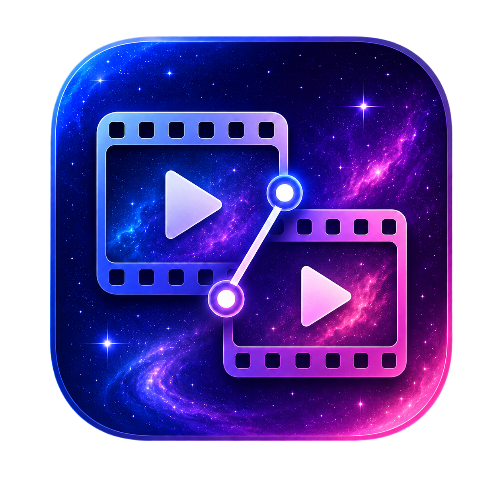
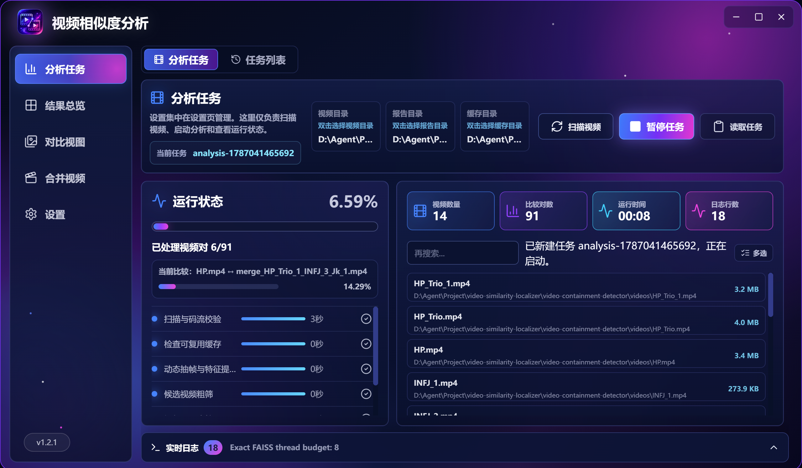
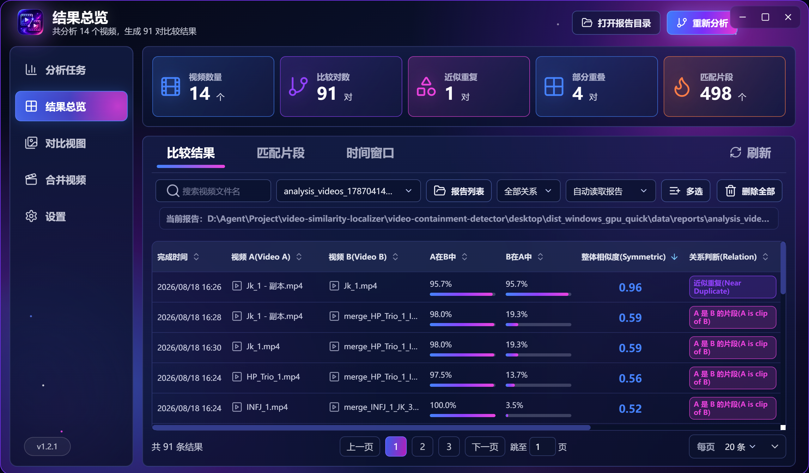
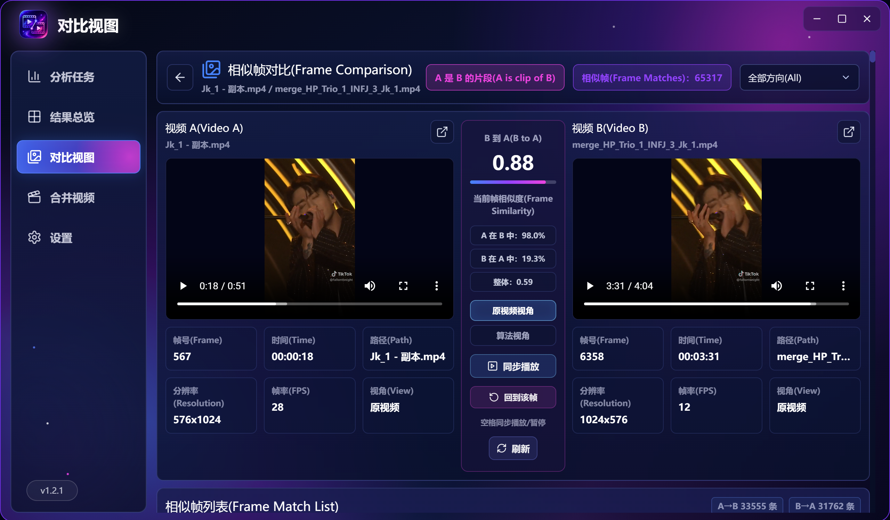
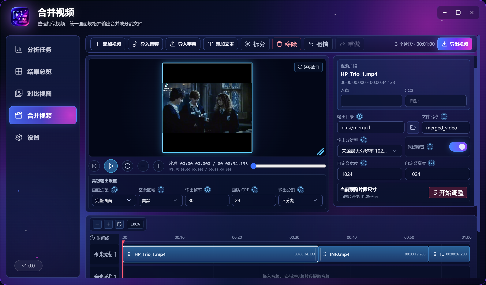
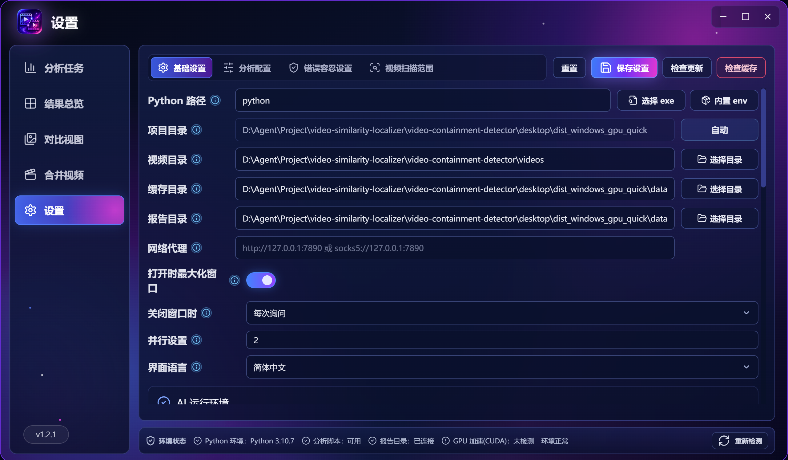

<p align="center">
  <a href="README.md">简体中文</a> | <a href="README_EN.md">English</a>
</p>

<p align="center">
  
</p>

<h1 align="center">视频相似度检测</h1>

<p align="center">本地优先的视频相似度、片段包含关系、重复文件和视频整理工具。</p>

<p align="center">
  <a href="https://github.com/RoamerFly/video-similarity-detector/releases"></a>
  <a href="LICENSE"></a>
  
  
</p>

<p align="center">
  <a href="#%E7%94%A8%E6%88%B7%E6%8C%87%E5%8D%97">用户指南</a> &nbsp;|&nbsp;
  <a href="#%E4%B8%8B%E8%BD%BD%E4%B8%8E%E5%AE%89%E8%A3%85">下载</a> &nbsp;|&nbsp;
  <a href="#%E5%9F%BA%E6%9C%AC%E4%BD%BF%E7%94%A8">使用</a> &nbsp;|&nbsp;
  <a href="#%E7%95%8C%E9%9D%A2%E9%A2%84%E8%A7%88">界面</a> &nbsp;|&nbsp;
  <a href="#%E5%BC%80%E5%8F%91%E8%80%85%E6%8C%87%E5%8D%97">开发</a> &nbsp;|&nbsp;
  <a href="#%E8%AE%B8%E5%8F%AF%E8%AF%81">许可证</a>
</p>

## 用户指南

### 它能做什么

- 扫描视频目录，找出相似视频、片段包含、部分重叠和完全重复文件。
- 生成 JSON、CSV、HTML 报告，并在桌面应用中筛选、排序、复核和删除结果。
- 支持动态抽帧、黑边裁剪、竖屏旋转、分辨率统一、CLIP 特征和 FAISS 检索。
- 支持任务历史、断点恢复、分阶段继续、缓存清理、错误视频隔离和视频扫描范围过滤。
- 支持多轨视频合并编辑，包含裁剪、旋转、拆分、跨轨拖放、音频和导出。
- 默认本地处理视频、缓存和报告，不依赖远程分析服务。

### 下载与安装

前往 [GitHub Releases](https://github.com/RoamerFly/video-similarity-detector/releases)，只需下载与你的系统对应的应用安装包：

- Windows：大多数用户下载 `windows-x64-cpu-installer.exe`；使用 NVIDIA Turing 或更新架构显卡（计算能力 7.5+、R580+ 驱动）时，可下载 `windows-x64-gpu-installer.exe`。
- macOS：M 系列芯片下载 `macos-arm64-installer.dmg`，Intel 芯片下载 `macos-x64-installer.dmg`。
- Linux：下载 `.deb`、`.rpm` 或便携 `.tar.gz`。
- 不想安装时，可以选择同平台的 `portable` 便携包，解压后直接运行。

从 v1.1.0 开始，应用与 AI 运行环境分开发布。安装包和便携包本身较小；第一次启动时，应用会自动安装一次对应的 Python、PyTorch 和 FFmpeg 运行环境。CPU 环境通常为数百 MB，Windows GPU 环境接近 2 GiB，请预留足够的下载时间和磁盘空间。

Windows 安装器支持自定义路径。主程序、`scripts`、`video_sim`、`env`、`models` 和 `data` 都位于用户选择的目录中；其中大型环境和模型放在独立子目录，覆盖更新不会删除或替换它们。

以后如果只是新增按钮、修改合并视频页面、修复界面或业务逻辑，更新程序只下载十几至几十 MB 的应用更新，不会重复下载运行环境和模型。只有运行环境版本确实发生变化时，才会再次下载。v1.0.x 用户如果程序旁仍保留旧 `env`，新版本会自动识别并继续使用，也可在“设置”中就地登记，无需移动或重新下载。

Release 中以 `Video_Similarity-runtime-` 开头的文件、`.sha256`、`*-updater`、`.sig` 和更新 JSON 均由应用自动选择和校验，普通用户不需要手动下载。Windows 安装版仍支持自定义目录、覆盖升级和卸载时选择是否保留数据、报告与界面设置。

### 离线模型

AI 相似度分析使用 `openai/clip-vit-base-patch32`。模型与应用、运行环境分别保存，首次分析会自动下载约 600 MB 的模型，后续小更新不会重复下载。离线使用可从 Release 下载：

```text
clip-vit-base-patch32.zip
```

解压到程序同级目录，最终结构为：

```text
程序目录/
└─ models/
   └─ clip-vit-base-patch32/
      ├─ config.json
      ├─ preprocessor_config.json
      └─ pytorch_model.bin
```

程序查找顺序：程序同级 `models/`、个人 Hugging Face 缓存、联网下载。应用内覆盖更新不会删除 `models/`。

### 基本使用

1. 打开应用，在“设置”中确认视频目录、缓存目录、报告目录和 CPU/GPU 环境。
2. 如需只处理部分视频，在“视频扫描范围”中按大小、名称、时长、分辨率、帧率或格式过滤。
3. 进入“分析任务”，扫描视频并新建任务。
4. 在“历史任务”中启动、暂停、继续或分阶段处理。
5. 在“结果总览”和“对比视图”中查看相似关系、匹配片段和算法帧。
6. 需要整理文件时，可右键视频或多选视频后移动、删除或打开文件位置。

### 界面预览

以下图片来自桌面应用真实界面。

#### 分析任务



#### 结果总览



#### 对比视图



#### 多轨合并编辑器



#### 设置



### 支持格式

视频：`mp4, mkv, avi, mov, webm, flv, wmv`

音频：`mp3, wav, flac, aac, m4a, ogg, opus, wma`

浏览器内置播放器能否直接播放还取决于系统 WebView2 和具体编码；无法播放时可使用帧预览辅助复核。

### 安全与隐私

- 视频默认只在本机处理，不主动上传媒体内容。
- 删除源视频是不可恢复操作，应用会在执行前请求确认。
- 分析结果可能存在误判，不应作为版权、法律或平台执法的唯一依据。

## 开发者指南

### 环境

- Node.js / npm
- Rust 与 Cargo
- Python 3.10+
- Windows 构建可选 CUDA / NVIDIA 驱动

安装前端依赖：

```powershell
cd desktop
npm install
```

Python 环境：

```powershell
python -m pip install -r requirements.txt
```

### 常用命令

```powershell
# 前端开发
cd desktop
npm run dev

# Tauri 开发
npm run tauri:dev

# 前端构建
npm run build

# Rust 检查与测试
cd src-tauri
cargo check
cargo test

# Python 语法检查示例
cd ../..
python -m py_compile scripts/batch_compare.py
```

### 打包

```powershell
cd desktop

# Windows CPU
.\build-windows.bat

# Windows GPU
.\build-windows-gpu.bat

# Linux
bash ./build-linux.sh

# macOS
bash ./build-macos.sh
```

输出目录通常位于 `desktop/dist_windows*`、`desktop/dist_linux`、`desktop/dist_macos`。

### 项目结构

```text
video-containment-detector/
├─ desktop/          # Tauri + React 桌面端
├─ scripts/          # Python 命令行入口
├─ video_sim/        # 抽帧、预处理、嵌入、匹配和报告逻辑
├─ tests/            # Python 测试
├─ docs/screenshots/ # 界面截图
├─ README_RECO.md    # 识别逻辑说明
├─ README_SET.md     # 设置与参数说明
└─ requirements.txt
```

### 相关文档

- [识别逻辑说明](README_RECO.md)
- [设置与参数说明](README_SET.md)
- [许可证](LICENSE)

## 致谢

本项目基于和使用了 [Tauri](https://tauri.app/)、[React](https://react.dev/)、[Vite](https://vite.dev/)、[Rust](https://www.rust-lang.org/)、[Python](https://www.python.org/)、[PyTorch](https://pytorch.org/)、[Transformers](https://huggingface.co/docs/transformers/index)、[OpenAI CLIP](https://github.com/openai/CLIP)、[FAISS](https://github.com/facebookresearch/faiss)、[OpenCV](https://opencv.org/)、[Decord](https://github.com/dmlc/decord)、[FFmpeg](https://ffmpeg.org/)、[Radix UI](https://www.radix-ui.com/)、[Lucide](https://lucide.dev/)、[Zustand](https://zustand-demo.pmnd.rs/)、[Playwright](https://playwright.dev/) 等开源项目。核心思路和早期实现参考了 [DewduSendanayake/Video-Similarity-Search](https://github.com/DewduSendanayake/Video-Similarity-Search.git)。

## 许可证

本项目基于 [MIT License](LICENSE) 开源。第三方依赖、模型和媒体内容仍遵循各自许可证。

## 免责声明

本项目用于本地视频相似度分析、重复内容识别和媒体整理。分析结果可能存在误判，不应作为版权、法律或平台执法的唯一依据。使用者应确保拥有处理相关媒体的合法权利，并遵守适用法律、平台规则及第三方许可证。
