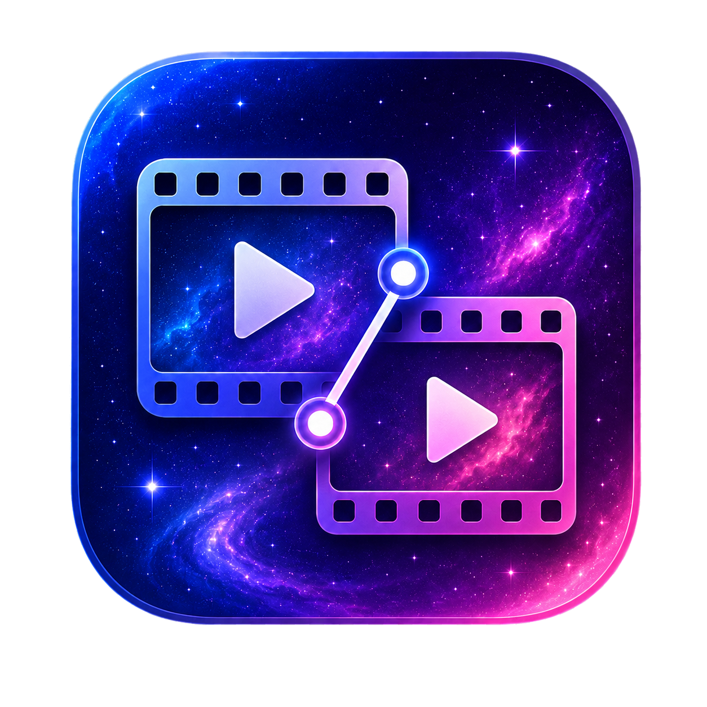

<p align="center">
  <a href="README.md">简体中文</a> | <a href="README_EN.md">English</a>
</p>

<p align="center">
  
</p>

<h1 align="center">Video Similarity Detector</h1>

<p align="center">A local-first desktop app for video similarity, containment, duplicate-file detection, and media cleanup.</p>

<p align="center">
  <a href="https://github.com/RoamerFly/video-similarity-detector/releases"></a>
  <a href="LICENSE"></a>
  
  
</p>

<p align="center">
  <a href="#for-users">Users</a> &nbsp;|&nbsp;
  <a href="#download-and-install">Download</a> &nbsp;|&nbsp;
  <a href="#basic-workflow">Workflow</a> &nbsp;|&nbsp;
  <a href="#ui-preview">Preview</a> &nbsp;|&nbsp;
  <a href="#for-developers">Developers</a> &nbsp;|&nbsp;
  <a href="#license">License</a>
</p>

## For Users

### What It Does

- Scans a video folder and finds similar videos, contained segments, partial overlaps, and exact duplicate files.
- Produces JSON, CSV, and HTML reports, with in-app filtering, sorting, review, and cleanup tools.
- Uses dynamic frame sampling, black-border cropping, portrait rotation, unified resizing, CLIP features, and FAISS search.
- Supports task history, resume, stage-based reruns, cache cleanup, damaged-video quarantine, and scan-range filters.
- Includes a multi-track video merge editor with crop, rotate, split, drag-and-drop, audio, and export.
- Keeps videos, caches, and reports local by default.

### Download And Install

Download the latest build from [GitHub Releases](https://github.com/RoamerFly/video-similarity-detector/releases):

- Windows: use `windows-x64-cpu-installer.exe` for most PCs; use `windows-x64-gpu-installer.exe` only with compatible NVIDIA GPU drivers.
- macOS: download the `macos-arm64` or `macos-x64` `.dmg` / portable package.
- Linux: download `.deb`, `.rpm`, or the portable `.tar.gz`.

The installers and portable packages include Python, FFmpeg, FFprobe, and the main runtime dependencies. The Windows installer supports custom install paths, overwrite upgrades, and uninstall options that can preserve `data/`, `videos/`, `embeddings/`, reports, and UI settings.

### Offline Model

AI similarity analysis uses `openai/clip-vit-base-patch32`. The app downloads it on first use. For offline use, download this asset from Releases:

```text
clip-vit-base-patch32.zip
```

Extract it next to the app:

```text
App folder/
└─ models/
   └─ clip-vit-base-patch32/
      ├─ config.json
      ├─ preprocessor_config.json
      └─ pytorch_model.bin
```

Lookup order: app-local `models/`, user Hugging Face cache, then online download. In-app overwrite updates do not remove `models/`.

### Basic Workflow

1. Open Settings and confirm the video folder, cache folder, report folder, and CPU/GPU environment.
2. Optionally configure Video Scan Range by size, name, duration, resolution, FPS, or extension.
3. Open Analysis Tasks, scan videos, and create a task.
4. Start, pause, resume, or rerun stages from History.
5. Review similar relations, matched segments, and algorithm frames in Results and Compare View.
6. To organize files, right-click or multi-select videos to move, delete, or reveal them in the file manager.

### UI Preview

The images below are captured from the real desktop app.

#### Analysis Tasks


#### Results Overview


#### Compare View


#### Multi-track Merge Editor


#### Settings


### Supported Formats

Videos: `mp4, mkv, avi, mov, webm, flv, wmv`

Audio: `mp3, wav, flac, aac, m4a, ogg, opus, wma`

Playback support also depends on the system WebView2 and the actual codec. When preview playback fails, frame previews can still help with review.

### Privacy And Safety

- Videos are processed locally by default and are not uploaded by the app.
- Deleting source videos is irreversible; the app asks for confirmation first.
- Similarity results may be wrong and should not be the sole basis for copyright, legal, or enforcement decisions.

## For Developers

### Requirements

- Node.js / npm
- Rust and Cargo
- Python 3.10+
- Optional CUDA / NVIDIA driver for Windows GPU builds

Install frontend dependencies:

```powershell
cd desktop
npm install
```

Install Python dependencies:

```powershell
python -m pip install -r requirements.txt
```

### Common Commands

```powershell
# Frontend dev server
cd desktop
npm run dev

# Tauri dev app
npm run tauri:dev

# Frontend build
npm run build

# Rust check and tests
cd src-tauri
cargo check
cargo test

# Python syntax check example
cd ../..
python -m py_compile scripts/batch_compare.py
```

### Packaging

```powershell
cd desktop

# Windows CPU
.\build-windows.bat

# Windows GPU
.\build-windows-gpu.bat

# Linux
bash ./build-linux.sh

# macOS
bash ./build-macos.sh
```

Outputs are usually written to `desktop/dist_windows*`, `desktop/dist_linux`, and `desktop/dist_macos`.

### Project Layout

```text
video-containment-detector/
├─ desktop/          # Tauri + React desktop app
├─ scripts/          # Python command entry points
├─ video_sim/        # Sampling, preprocessing, embeddings, matching, reports
├─ tests/            # Python tests
├─ docs/screenshots/ # UI screenshots
├─ README_RECO.md    # Recognition logic notes
├─ README_SET.md     # Settings and parameter notes
└─ requirements.txt
```

### Related Docs

- [Recognition logic](README_RECO.md)
- [Settings and parameters](README_SET.md)
- [License](LICENSE)

## Credits

This project uses [Tauri](https://tauri.app/), [React](https://react.dev/), [Vite](https://vite.dev/), [Rust](https://www.rust-lang.org/), [Python](https://www.python.org/), [PyTorch](https://pytorch.org/), [Transformers](https://huggingface.co/docs/transformers/index), [OpenAI CLIP](https://github.com/openai/CLIP), [FAISS](https://github.com/facebookresearch/faiss), [OpenCV](https://opencv.org/), [Decord](https://github.com/dmlc/decord), [FFmpeg](https://ffmpeg.org/), [Radix UI](https://www.radix-ui.com/), [Lucide](https://lucide.dev/), [Zustand](https://zustand-demo.pmnd.rs/), [Playwright](https://playwright.dev/), and other open-source projects. The core idea and early implementation were inspired by [DewduSendanayake/Video-Similarity-Search](https://github.com/DewduSendanayake/Video-Similarity-Search.git).

## License

This project is released under the [MIT License](LICENSE). Third-party dependencies, models, and media content remain under their own licenses.

## Disclaimer

This project is intended for local video similarity analysis, duplicate-content detection, and media organization. Results may contain false positives or false negatives and should not be used as the sole basis for copyright, legal, or platform-enforcement decisions. Users are responsible for ensuring they have the legal right to process the relevant media and for complying with applicable laws, platform rules, and third-party licenses.
