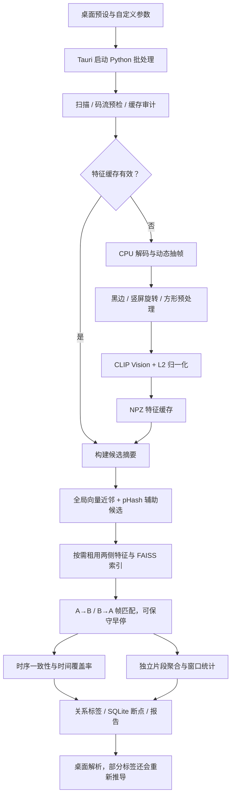

# 视频相似度识别链路与优化分析（探索性）

分析日期：2026-08-31。基于工作区当前代码（HEAD 为 c080806d，同时存在用户未提交的桌面端、运行环境和合并模块修改），不是只依据 README 或已发布版本。

**结论：可以优化，优先顺序应是评分与结果一致性、性能瓶颈的可观测性、资源管理与计算效率，最后才是更换模型或扩大计算规模。** 当前系统已具备候选粗筛、流式提特征、缓存校验、索引资源池和断点续算，继续简单堆高分辨率、Top-K 或并发数，不能保证准确率或速度提高。

本轮没有修改应用算法、配置默认值、用户媒体或原有工作区改动。新增此报告和本地诊断产物；没有对源视频目录启动可能自动隔离并移动文件的完整批处理。

## 1. 项目结构与范围

| 层级 | 职责 | 主要入口 |
| --- | --- | --- |
| 桌面界面 | 参数预设、扫描范围、任务管理、结果复核、视频合并 | [配置及预设](../desktop/src/types/config.ts#L145)、[AnalyzePage](../desktop/src/pages/AnalyzePage.tsx) |
| Rust/Tauri | 选择运行环境、拼接参数、启动 Python、处理进度/暂停/恢复、读取报告和文件操作 | [main.rs](../desktop/src-tauri/src/main.rs#L3315) |
| 批处理调度 | 扫描与预检、缓存审计、特征提取、候选选择、并行比较、SQLite 断点和报告 | [batch_compare.py](../scripts/batch_compare.py#L1359) |
| 算法核心 | 预处理、抽帧、向量、索引、匹配、时序聚类、覆盖率 | [video_sim](../video_sim/__init__.py) |
| 展示与兼容 | JSON/CSV 解析、关系标签兼容修正、片段和匹配帧展示 | [reportParserCore.ts](../desktop/src/utils/reportParserCore.ts#L110) |
| 旧接口 | Flask 与视频级平均向量检索，和当前桌面帧级包含检测不是同一条流程 | [app.py](../app.py)、[VideoMatcher](../video_sim/matcher.py#L967) |
| 验证工具 | 单元测试、合成向量基准、合成视频配合真实 CLIP 的端到端基准 | [tests](../tests/conftest.py)、[端到端基准](../scripts/benchmark_end_to_end.py) |

合并编辑器和打包系统已确认与识别模块的接口边界，本轮不评价合并功能质量。文件完全重复检测属于另一种模式，不应与画面相似度及片段包含混为同一准确率指标。

## 2. 当前实际识别链路



### 2.1 扫描与预检

扫描阶段使用路径、大小、修改时间等信息关联任务与缓存。FFmpeg 预检采用 `-c:v copy -f null` 遍历视频码流，是额外的读文件/解复用过程，**不是把视频完整解码两遍**。它可能带来额外 I/O，但不能发现所有像素解码错误。已完成的扫描阶段可以复用。

[预检实现](../scripts/batch_compare.py#L144)；[扫描实现](../video_sim/scanner.py#L18)。

### 2.2 动态抽帧

每隔 `frame_step` 帧检查一次；第一帧保留。画面经几何预处理后计算 pHash，与“上一张保留帧”比较；相似度低于 `skip_threshold` 时保留，超过 `max_gap_sec` 时强制保留。

因此：

- `skip_threshold` 越高，一般保留越多帧，不是越容易跳过。
- `max_gap_sec` 约束的是保留帧间隔，并不保证每个短片段都被采到。
- pHash 在此用于决定是否保留帧；最终逐帧精确比较并没有要求 pHash 也通过。
- `frame_step=1` 优先 Decord；大于 1 时优先 OpenCV 顺序读取，并用 `grab()` 跳过间隔帧。步长不意味着底层解码成本也按同样比例减少。

当前时间戳主要来自“帧号 / 平均帧率”，时长来自“帧数 / 平均帧率”并写入缓存。比仅取最后保留帧更合理，但对变帧率、时间戳异常和解码丢帧仍有风险。

[抽帧实现](../video_sim/frame_sampler.py#L358)。

### 2.3 预处理与帧特征

处理顺序是可选黑边裁剪、竖屏转横屏、方形缩放/裁剪。竖屏旋转当前只有左右 90 度，没有保持原方向选项。

实际提取的是 `CLIPVisionModel.pooler_output`，再做 L2 归一化。默认模型的视觉隐藏维度为 **768**，不是代码部分注释声称的 512。已有本地缓存也验证为 `(653, 768)`。512 是该 CLIP 模型的投影维度，而当前路径未调用投影头。

当前模型处理器会再次把输入调整为 **224×224**。因此界面里的 256、384 只是前置预处理尺寸，不等于以相同尺寸进入模型推理。

[特征实现](../video_sim/embedder.py#L360)；[模型配置](../video_sim/model_locator.py#L11)；[官方模型配置](https://huggingface.co/openai/clip-vit-base-patch32/blob/main/config.json)；[官方预处理配置](https://huggingface.co/openai/clip-vit-base-patch32/blob/main/preprocessor_config.json)。

特征默认 FP32，CUDA autocast 已实现但默认关闭。CUDA 路径已用有界队列让解码与嵌入重叠；CPU 路径按批同步消费。CUDA OOM 后会减小批量。不要将这些已有功能列为“尚需新增”。

### 2.4 缓存与候选筛选

每个视频按抽帧/预处理配置保存 NPZ；缓存元数据还校验文件状态、模型标识、数值精度和 schema。热缓存分析可以不加载模型。

当前批处理实际采用：

- 每视频最多 64 个查询代表帧；
- 每视频最多 1024 个进入全局索引的代表帧；
- 另保留全体抽样帧的时间戳和 64 位 pHash，缺失有效 pHash 时使用向量 SimHash；
- 全局向量数小于 4096 使用 Flat，否则使用 HNSW；
- 每个视频选择最多 `candidate_limit` 个目标，任意一侧选中即保留该视频对；
- `candidate_limit=0` 或候选上限覆盖全部其他视频时，全量枚举视频对。

注意：64/1024 是批处理入口参数，候选函数自身默认索引上限为 2048。摘要向量有每视频上限，但所有视频摘要及全帧哈希总量仍随库规模增长。

候选数不是单视频最终参与比较次数的严格上限：其他视频也可以反向选择它。未进入候选的对没有精确比较，不能当作已证明不同。

[候选算法](../video_sim/candidate_selector.py#L71)；[批处理摘要参数](../scripts/batch_compare.py#L1775)；[批处理候选调用](../scripts/batch_compare.py#L2088)。

### 2.5 双向匹配与时序评分

每个活动视频使用 FAISS `IndexFlatIP`，归一化向量内积即余弦相似度。逐方向取 Top-K，再保留达到 `match_threshold` 的匹配点。

这里的“精确”表示相对于已缓存向量执行 Flat 检索，不表示逐像素验证、完整原视频逐帧比对，也不是保证视觉内容身份一致。

整体评分先按源时间、目标时间排序，单遍构造连续轨迹；判断包含：

- 源和目标时间间隔；
- 目标时间单调性及小幅抖动；
- 与当前簇平均偏移的差；
- 在线仿射趋势、斜率和残差。

匹配通过后，以采样帧左右相邻时间中点形成的时间单元估计覆盖时长：

```text
a_in_b = A 中通过时序一致性验证的时间单元并集长度 / A 时长
b_in_a = B 中通过时序一致性验证的时间单元并集长度 / B 时长
symmetric_similarity = (a_in_b + b_in_a) / 2
```

这不是简单的“匹配帧数 / 抽帧数”，也不是模型给出的真实性概率。缺少有效时长/时间线的兼容路径才会退回帧数比。

例如，A 是 60 秒片段、B 是 600 秒原片，理想情况下 A 的覆盖率接近 100%，B 的覆盖率接近 10%，平均约 55%；用平均分去筛“高相似”会漏掉很强的包含关系。

[匹配与评分](../video_sim/matcher.py#L188)；[时序覆盖率](../video_sim/matcher.py#L340)；[结果构建](../video_sim/matcher.py#L883)。

### 2.6 关系标签、片段和窗口

Python 关系判定是启发式：时长或保留帧数差异明显时优先判包含，其次看双向覆盖率、方向差及部分重叠阈值。片段最短长度、匹配点数和可配置 offset 容差是在另一条聚合路径处理的。

**可配置 `offset_tolerance` 主要影响片段聚合；整体覆盖率仍使用 matcher 内部默认 3 秒容差。** 调整片段参数并不一定改变整体覆盖率。窗口也直接使用原始阈值匹配点，而不是仅使用通过时序验证的点。因此目前“整体分数、窗口分数、片段”本来就可能不是同一证据口径。

[关系规则](../video_sim/matcher.py#L291)；[片段聚合](../video_sim/segmenter.py#L212)；[窗口统计](../video_sim/segmenter.py#L87)；[调用位置](../scripts/batch_compare.py#L2213)。

## 3. 参数与文档不能当作同一套默认值

| 参数 | 桌面“普通”/初始设置 | batch_compare CLI 默认 |
| --- | ---: | ---: |
| pHash 跳帧阈值 | 0.82 | 0.90 |
| 帧匹配阈值 | 0.64 | 0.65 |
| frame_step | 6 | 1 |
| max_gap_sec | 18 | 5 |
| top_k | 5 | 10 |
| candidate_limit | 20 | 20 |
| 窗口秒数 | 60 | 30 |
| 比较并发数 | 2 | 1 |
| 黑边裁剪 | 开启 | 关闭 |
| 前置输入尺寸 | 224 | 224 |

30 FPS 视频在桌面普通配置下每约 0.2 秒检查一次，但静态画面可隔 18 秒才保留一帧。因此“检查频率”“保留频率”“最终定位误差”必须分别说明。

“完美”预设提高采样密度和 Top-K、关闭候选裁剪，但也提高匹配阈值到 0.72；严格阈值可能漏掉重压缩/裁剪版本。它既不是理论完美，也不保证所有数据集上的召回率优于普通预设。

README_RECO 仍包含基于偏移排序、主要取单一簇、帧数覆盖率和评分版本 3 的描述；当前代码是源时间顺序、多个有效簇贡献、时间加权覆盖率、评分版本 4。后续开发应先统一说明文档与实际语义。

## 4. 精确度：优先解决的具体问题

下表中的“复现”均为**探索性确定性诊断**，不是现实视频误判比例或准确率估计。

| 优先级 | 问题及证据 | 实际影响 | 建议 |
| --- | --- | --- | --- |
| P0 | 同一源帧同时存在两条有效目标轨迹时，覆盖率从 1.0 变为 0.0；片段模块仍输出两条完整轨迹 | 多次复用、相似镜头、较大 Top-K 可能反而漏检，整体与片段互相矛盾 | 构建能保留多条候选轨迹的对齐模块，整体和片段共用其输出 |
| P0 | 簇的最小证据要求检查匹配点数量，没有要求独立源帧数量；20 个源帧各自只指向同一 3 帧小窗口也能得到 100% 源覆盖率 | 多候选重复计数可让证据很弱的簇通过；稀疏时间单元放大影响 | 校验独立源帧、独立目标帧、双方时间跨度，并限制异常多对一映射；静态内容另定证据规则 |
| P0 | Python 报告 partial_overlap，桌面重新推导为 A_is_likely_clip_of_B；例：覆盖率 0.76/0.50、双方均 60 秒 | 同一结果在 JSON 和 UI 上含义不同 | 现代报告以版本化后端判定为准，旧报告迁移规则隔离 |
| P0 | 帧缓存校验模型/精度，但视频对断点签名缺少模型指纹和 embedding_runtime | 换模型或打开 FP16 后可能重建特征，却仍恢复之前的视频对结果 | pair key 纳入两侧特征内容/配置摘要与评分版本，分离纯展示参数 |
| P1 | 两段都是 60 秒、双向覆盖率都是 1，仅保留帧数由 100/100 变为 200/100，关系就从近重复变为 B 是 A 片段 | 采样密度差异被错误当作时长差异；有时还会干扰方向 | 时长可靠时以时长为主，帧数只在时长未知时作为弱回退 |
| P1 | 10 秒视频每秒都有匹配，60 秒窗口覆盖率为 16.7%，窗口结束时间还显示 60 秒 | 短视频/末尾不足整窗时低估覆盖率；影响复核 | 窗口裁到实际时长，分母用有效窗口长度，并处理跨窗口的采样时间单元 |
| P1 | 单一 CLIP 相似度阈值作为视觉匹配入口，缺少内容身份的第二阶段验证 | 语义相似可能误报；强裁剪、字幕和镜像等改动可能漏报 | 候选保召回，局部复核验证身份；分别报告“视觉相似”“内容复用”证据 |
| P1 | 稀疏帧的时间单元可覆盖较长时段；定位边界仍取首末匹配帧时间 | 覆盖率可很高但边界较粗；少量异常样本代表过长内容 | 对候选片段与边界补抽帧，输出边界误差/证据不足状态 |
| P2 | 源/目标时间用平均 FPS；硬编码斜率约 0.65–1.5，且仍约束平均 offset | 变帧率、显著变速、倒放和长距离速度漂移适配有限 | 使用真实 PTS；以仿射残差替代固定 offset 作为变速模型主约束；是否支持倒放单独定义 |
| P2 | 每帧独立黑边检测、强制竖屏旋转、中心裁剪 | 暗场可能裁剪抖动；竖版裁剪和横版原片方向不一致；边缘线索丢失 | 多帧稳定边界、允许不旋转、按素材类型选择完整画面或局部视图 |

P0 多轨迹问题的直接原因是：所有 Top-K 点排序后塞进同一条贪心轨迹，另一个有效目标时间会打断原轨迹。直接把 Top-K 固定为 1 虽能减少此类干扰，却可能丢掉真实的次优对应，不能视为完整修复。

片段模块有“未得到片段时按 offset 分组再尝试”的兼容回退，matcher 覆盖率没有同样路径，这解释了诊断中的矛盾。长期应共用一套对齐结果，不宜继续给两个模块各补一套互不一致的规则。

置信度当前也是匹配点数、均值相似度和偏移稳定性的加权公式，不是经过校准的概率；增加重复候选可能提高匹配点数分项。建议输出独立证据数、有效时长、拟合残差等可解释指标。

相关位置：[时序证据计数](../video_sim/matcher.py#L367)、[片段兼容回退](../video_sim/segmenter.py#L300)、[前端推导](../desktop/src/utils/relation.ts#L130)、[前端覆盖标签](../desktop/src/utils/reportParserCore.ts#L450)、[断点签名](../scripts/batch_compare.py#L664)。

## 5. 识别时长：按场景区分瓶颈

### 5.1 冷缓存与热缓存是两类任务

```text
冷缓存总耗时 ≈ 启动/模型加载 + 预检I/O + 解码/预处理/嵌入流水线
              + 缓存写入/摘要 + 候选筛选 + 视频对读取/建索引/匹配
              + 片段/窗口 + 断点与报告

热缓存总耗时 ≈ 启动/预检 + 读取缓存/构建摘要 + 候选筛选
              + 未完成视频对的加载/匹配 + 报告
```

CUDA 解码和嵌入可能重叠，不能将每个阶段累积时间直接相加当作墙钟耗时。

- 少量长视频首次分析，解码、pHash 和嵌入通常是应优先测量的环节；库规模小不代表省抽帧时间。
- 大量已有缓存的视频，候选索引构建、哈希辅助扫描、缓存反复读取、精确匹配和报告可能占主导。
- 仅修改展示参数却让已完成精确比较失效，会产生本可避免的重算。
- 调大 compare_workers 只影响视频对精确比较，不会并行提取多个视频的 CLIP；FAISS 目前是 CPU 版本，精确比较也没有自动转为 GPU。

### 5.2 具体可优化项

| 优先级 | 现状与问题 | 优化方向 | 代价/限制 |
| --- | --- | --- | --- |
| P0 | 候选模块强制 FAISS 线程数为 1；索引模块缓存“上次设过的预算”，相同预算会跳过实际设置 | 每阶段明确设置、读取并记录实际预算；统一管理所有写入点 | 单工作线程且实际进行了粗筛时，可复现日志预算和实际值不同；尚未测其具体耗时影响 |
| P1 | 128/224/256/384 前置画面最终都变成 224 模型输入 | 分离 hash 尺寸、几何预处理尺寸、真实模型尺寸；重新解释预设 | 降前置尺寸可减少部分 CPU 工作，但不会按面积比例减少 CLIP 前向计算；需验证细节损失 |
| P1 | 黑边检测、原始帧复制和几何预处理较重；保留帧还分别为 pHash/CLIP 做处理 | 复用裁剪坐标与几何参数；缩小黑边检测图；减少完整帧拷贝 | hash 当前用 AREA、CLIP 用 LINEAR，不能简单复用相同缩小图而声称数值完全一致 |
| P1 | GPU 默认批量较保守，队列仅少数批；还存在桌面启动时的批量覆盖 | 测 GPU 利用率、队列等待和批量 8/16/32；做按显存与延迟目标的调度 | FP16/BF16 已有开关，启用前需做阈值邻域和标签一致性验证 |
| P1 | 候选代表向量/全局 HNSW/全帧哈希索引每次任务重建 | 持久化每视频摘要；对固定库设计增量候选索引 | 必须正确处理模型、配置、文件删除与更新；全局索引维护复杂度上升 |
| P1 | 辅助 pHash 检索在 Python 中逐帧逐 band 再逐命中遍历 | 向量化、批量汉明距离、限制常见静态 hash 的贡献 | 直接降低召回通道预算可能漏掉短片段，必须独立测候选召回 |
| P1 | NPZ 整块读取、资源池淘汰后要再次读取并建索引 | 独立元数据/摘要；必要时 NPY/mmap；按共享视频组织比较任务 | 这是 I/O、内存、实现复杂度间的权衡，不应直接改为全部常驻 |
| P2 | 双向 Flat 比较分别算相似度，Python 创建大量 FrameMatch 对象 | 分块矩阵乘法同时维护两个方向 Top-K；候选点用紧凑数组并延迟转对象 | 禁止生成完整长视频相似度矩阵；需验证两侧 Top-K、并列相似度及早停语义 |
| P2 | 每对提交 SQLite 会建立连接/事务，报告逐对累积 | 单连接批量小事务、保持崩溃损失窗口有界；报告按需加载 | 不应牺牲已完成任务的可恢复性 |

当前保守早停只在先查的一侧完全没有阈值匹配且 p99 明显偏低时跳过另一方向。相同归一化特征上的点积具有对称性，因此它比“任意抽几帧就判不同”可靠；不过跳过反向后的 raw mean/p95 等统计并不等价于完整双向统计。建议增加是否完整查询的字段。

FAISS 官方指出 OpenMP 线程设置具有线程局部语义，生产线程池不应只依赖主线程设置。当前本机诊断中新建线程读到 4，与主线程一致，**本轮未复现该跨线程差异**；需在实际 CPU/GPU 打包运行环境检查每个工作线程。已明确复现的是预算缓存与候选模块显式覆盖之间的冲突。[FAISS 官方 FAQ](https://github.com/facebookresearch/faiss/wiki/FAQ#why-are-the-number-of-openmp-threads-not-being-set-correctly-when-calling-faissomp_set_num_threadsn)。

桌面启动代码先写 OMP/TORCH=1，但随后通用配置函数重新设置为可用线程数减一、限制到 1–4；最终不能仅看前一个赋值。CPU 内部线程、OpenCV、FAISS 和视频对并发应有统一总预算。[启动位置](../desktop/src-tauri/src/main.rs#L3535)、[最终环境配置](../desktop/src-tauri/src/main.rs#L7208)。

## 6. 性能占用：流式与资源池仍有哪些边界

### 6.1 关键内存组成

设一个视频保留 F 帧，向量维度 d=768，FP32：

```text
单份向量 ≈ F × 768 × 4 字节
特征缓存 + Flat 索引向量 ≈ F × 768 × 8 字节
```

单视频 F=100,000 时，两份向量约 586 MiB；两个这样的视频同时比较，仅这部分约 1.14 GiB，尚未计算元数据、Top-K、Python 对象、库分配器、模型和解码器。

| 项目 | 当前限制 | 仍需关注 |
| --- | --- | --- |
| 预处理帧队列 | CUDA 有界、CPU 分批 | 只约束缩小后的帧，不等于约束整个进程 |
| 原始解码帧 | Decord 每批最多 64 帧 | 3840×2160 RGB ×64 约 1.48 GiB，另有内部解码缓存/拷贝；这是公式估算，不是本轮 RSS 测量 |
| 单视频嵌入结果 | 全部 embedding_chunks 保留到结束 | 拼接和 astype 还产生瞬时额外向量拷贝；超长视频仍随 F 增长 |
| 精确资源池 | 最少 2 个，批处理容量至少 2×compare_workers | 按视频个数限额，不按字节；不能保证内存硬上限 |
| 候选摘要 | 单视频代表向量有上限 | 所有视频摘要、时间戳、哈希、HNSW 与构建期副本仍随 N 和总帧数增长 |
| 匹配点 | 每帧最多 Top-K | Python 对象和排序内存约随 (F_A+F_B)×K 增长 |
| 历史结果/报告 | 每方向序列化匹配最多 240 条 | SQLite 恢复使用 fetchall，报告和窗口/片段集合仍随比较对数增长 |
| 模型内存 | 模型跨视频复用 | 特征提取结束后 main 中仍持有 embedder；CPU 精确比较阶段仍可能保留模型及 CUDA 分配 |

[Decord 批读取](../video_sim/frame_sampler.py#L472)、[流式拼接](../video_sim/embedder.py#L794)、[资源池](../video_sim/resource_pool.py#L33)、[FAISS 自有向量拷贝](../video_sim/indexer.py#L287)、[断点整体加载](../scripts/batch_compare.py#L794)。

### 6.2 建议的资源策略

1. **按字节限额**：解码批量按分辨率缩小；精确资源池估计缓存和索引字节数，连同在途任务共同调度。保留用户设置的 CPU/内存上限。
2. **阶段及时释放**：无后续嵌入任务时释放模型；GPU 缓存清理在阶段结束时做一次，不在每个正常 batch 做。
3. **长视频结果流式落盘**：向量采用预分配/分块文件；避免收集全部 chunk 后再复制成数份连续矩阵。
4. **先计算数组再构造对象**：只将用于报告或后续验证的匹配证据转为 Python 对象。
5. **控制总资源而非仅并发数**：给出“后台低占用 / 均衡 / 尽快完成”预算，和“召回优先 / 误报优先”的算法目标分开配置。
6. **大库结果分页**：已有 SQLite 继续复用，避免为恢复/报告一次性加载所有结果。报告导出采用迭代生成。

## 7. 当前证据能证明什么

### 7.1 本轮执行

- 运行 Python tests 中除视频合并测试外的全部识别相关测试：**133 passed，pytest 报告耗时 6.87 秒**。
- 执行时序多轨迹、独立证据计数、帧数影响标签、窗口尾段、FAISS 预算及模型处理尺寸的确定性诊断。
- 用现有 esbuild 打包实际前端报告解析函数，复现后端 partial_overlap 被界面改成片段包含。
- 读取本地已有特征缓存，确认默认输出实际为 768 维。
- 读取本地模型处理器，不下载模型、不重新提取真实视频 CLIP 特征。
- 本轮 Python 为 3.13.13、torch 2.9.1+cpu、FAISS 1.14.3；本轮没有 GPU 吞吐/显存测量。
- pytest 仅安装到本地诊断目录 test_deps，没有修改 requirements 或打包运行环境。

产物：本地诊断目录 `data/analysis_20260831/`（诊断脚本、JSON 结果和测试日志均为本地证据，不随提交）。

测试全绿说明既有断言通过，不代表已覆盖真实内容分布。新增诊断说明代码存在明确边界问题，不能据此推断这些问题在用户视频库出现的频率。

### 7.2 已有历史基准

| 基准 | 已有记录 | 能支持的范围 |
| --- | --- | --- |
| 候选筛选 | 128 个合成视频向量集、32 维；标注正对仅 8 个；优化模式召回 8/8，旧模式 5/8；记录耗时约 8.44/2.82 秒 | 说明候选召回/耗时存在取舍；不能宣称优化后所有场景更快或真实召回 100% |
| 流式内存 | 人造像素队列，不加载 CLIP、不解码真实视频 | 能检验准备帧的生命周期有界；不能代表整条链路的 4K 峰值内存 |
| 资源池 | scale 为 24×4096×512；实际精确比较只有 3 对 | 支持资源常驻有上限及选定结果一致性；不能代表密集候选图的大规模吞吐 |
| 端到端 final5 | 12 秒低分辨率合成基片及 5 个派生/无关片，真实 CLIP，记录中只有 CPU worker；候选保留全部 15 对 | 验证部分链路可运行、缓存可复用；不能证明 HNSW 召回、自然视频准确率或 GPU 性能 |

历史记录路径（本地、不随提交）：`data/benchmarks/benchmark_candidate_selector.final.json`、`data/benchmarks/benchmark_streaming_memory.final.json`、`data/benchmarks/benchmark_resource_pool.final.json`、`data/benchmarks/benchmark_end_to_end.final5.json`。

没有使用这些历史时间宣称当前改进收益。它们来自其他 Python/运行环境，且与当前代码的精确对应关系未重新认证。端到端校验还允许挑选最有利片段检查边界，没有同时严格约束两边所有区间；报告中存在一侧零长度的片段。这是后续验证规范需要补强的地方。

### 7.3 可观测性缺口

当前 metrics 有阶段累积时间、部分计数、RSS 和 CUDA 内存，但缺少完整 CPU 利用率、GPU 利用率、磁盘吞吐、解码等待、GPU 消费等待以及缓存/索引加载独立耗时。

另有三个口径问题：

- preprocess 是 decode_sample 内部的嵌套时间，GPU 的 decode_sample 包含队列等待；不能简单相加。
- 并行比较时间为累计工作时间，不等于用户等待时间。
- 一些流式计数用 set_count，会被最后一个视频覆盖；批量大小指标也可能只代表最近一批。报告 metrics 在写报告前抓取，未包含报告生成全过程。

应同时输出“端到端墙钟时间、分阶段工作时间、等待时间、资源曲线”，明确每项是运行累计、单视频还是最近批次。

## 8. 建议的实现顺序

| 阶段 | 可独立交付的内容 | 主要收益 | 必须满足的验收 |
| --- | --- | --- | --- |
| A：正确性基础 | 统一时序轨迹输出，修复多候选/重复计数/前后端标签/窗口尾段，补 pair 缓存签名 | 精确度、可解释性；避免后续实验复用旧结果 | 固定反例回归；同一报告 UI/JSON 关系一致；模型和精度变更使相应结果失效 |
| B：行为保持的工程优化 | 线程预算统一、解码按字节批量、阶段释放模型、减少可证明冗余拷贝、完整 metrics | 耗时与 CPU/RAM/VRAM 占用 | 固定特征上的候选/结果一致；内存预算和取消/恢复不回退 |
| C：可控速度优化 | 持久化摘要、缓存加载与任务顺序优化、批量/混合精度调度 | 热缓存、大库吞吐及 GPU 利用率 | 测候选召回及阈值邻域；冷/热缓存单独比较；不只报告单次最快时间 |
| D：识别能力扩展 | 片段/边界二次抽帧，视觉身份复核，镜像/裁剪/变速适配 | 强变换召回、低误报、边界精度 | 在未用于调参的真实素材上分类型评价，同时满足耗时与资源约束 |

建议从 A+B 中拆出小范围变更，逐项落地，不一次性替换整个识别系统。

模型路线应作为后续受控对照：当前 768 维视觉 pooler 特征可以与 CLIP 投影特征、专门的复制检测描述符做比较，不能只因后者维度更小就默认更准。SSCD 官方提供图像复制检测描述符和推理模型，可作为实验参考；仓库已经归档，集成时需要单独评估兼容性、维护和模型使用条件，本轮不建议直接作为生产替换。[SSCD 官方项目](https://github.com/facebookresearch/sscd-copy-detection)。

## 9. 新需求的定义与验收基础

后续应先明确“相似”的业务含义，以下目标不能用一个分数代替：

| 需求方向 | 主要指标 | 对算法的要求 |
| --- | --- | --- |
| 相同/近重复视频整理 | 精确率、误删除风险、双向覆盖 | 优先控制误报；报告身份依据 |
| 从长视频定位短片段 | 候选召回、片段召回、定位误差 | 关注短片段覆盖率，不能只看双向平均分 |
| 两长视频寻找局部重叠 | 绝对匹配秒数、片段数、双侧区间 IoU | 2 分钟重叠在两部 2 小时视频中占比很小，当前 relation 仍可能是 different |
| 语义近似素材检索 | 检索排序质量、人工相关性 | 应保留语义模式，不用复制检测标准一概过滤 |
| 后台大库增量扫描 | 单新增视频时间、候选召回、I/O、资源上限 | 复用库索引和缓存，不让未改动视频全面重算 |

建议的验证集包含：完全相同/重编码、裁剪/加边/字幕/水印、竖横屏改版、镜像、0.8/1.25/1.5/2 倍速、1–3 秒短片段、长片中间短插入、多次复用/乱序拼接，以及同人不同镜头、相同片头/Logo、黑屏、PPT、录屏等困难负例。速度范围是待覆盖的需求维度，不是当前已支持保证。

每个正例需要两侧真实对应时间区间，按原始来源视频分组划分开发/验证集，避免同源变体跨集合泄漏。先冻结抽样、主指标、参数对照与资源预算，再对未用过的评估集作正式比较；本轮结果全部按探索性记录。

性能必须分别测：

- 无特征缓存、特征热缓存但重算视频对、任务断点复用、新增少量视频四种状态；
- 短视频库、长视频库、4K、变帧率和高动态内容；
- 端到端耗时、每视频/每对 P50/P95、处理视频时长/墙钟时间；
- 平均/峰值 CPU、RSS/提交内存、GPU 利用率、已分配/保留显存、I/O 及缓存增长；
- 候选 Recall@K、最终精确率/召回率、关系分类、双方片段 IoU、起止点误差。

暂不承诺“准确率提升多少”或“加速几倍”。在上述口径建立前，这类数字无法可靠支撑新需求决策。
